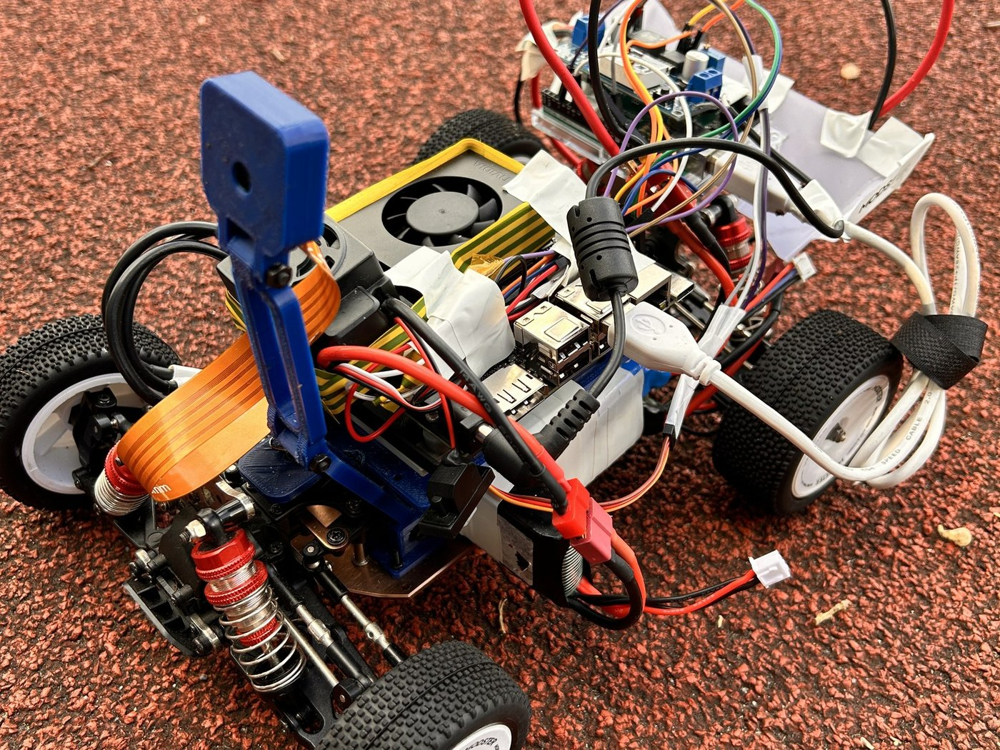
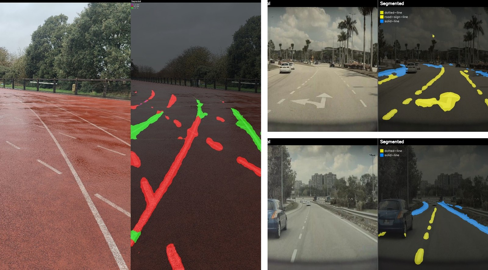
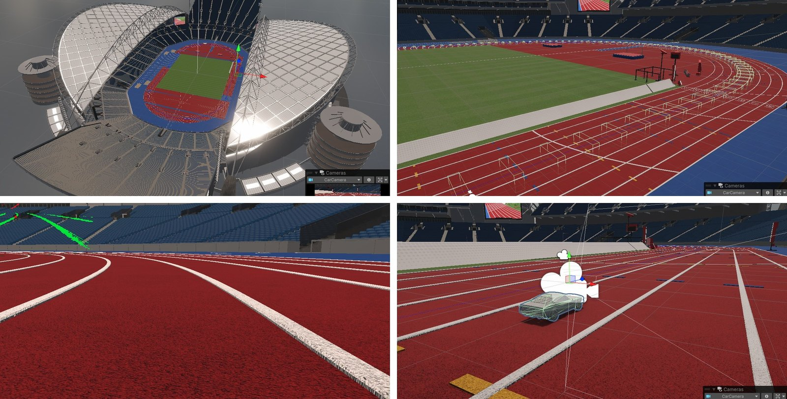

# Vision-Based Autonomous Lane Following

A 1:14 scale robotic vehicle that follows lane markings on an athletics running track using
a single forward-facing camera as its only source of environmental information. No GPS, no
LIDAR, no prior map, no knowledge of its own absolute position.

Demonstrated on the Dangan athletics track, University of Galway, where the vehicle
maintained lane position between adjacent markings while driving forward under autonomous
control.

### The vehicle



A 1:14 scale chassis carrying a Jetson Orin Nano, an Arduino Uno for actuation, and a CSI
camera on a printed bracket. The camera is the only sensor.

### Perception



Left: the Dangan athletics track under wet, overcast conditions, with continuous and broken
markings correctly separated. Right: unseen road dashcam footage. The model was fine-tuned
on a public road-marking dataset and had never encountered an athletics track, so both are
zero-shot transfer to unseen domains.

### Digital twin



A Unity reconstruction of the stadium used to develop and validate the controller before
touching hardware. Clockwise from top left: the complete 400 m oval; generated checkpoint
volumes and the centreline spline along the target lane; the simulated vehicle with its
camera; and the vehicle's own camera view, which is the only input the controller receives.
The virtual camera is configured from the physical sensor's optical parameters rather than
by eye.

---

## How it works

```
CSI camera
    -> SegFormer-B0 (TensorRT FP16)      640x640 RGB in, 160x160x8 class mask out
    -> lane extraction                   per-row line detection -> lateral offset + heading
    -> controller                        Kalman filter + PID  (or a learned policy)
    -> Arduino Uno over I2C              generates the PWM
    -> steering servo + brushless ESC
```

The lane extraction stage reduces a 25,600-value class map to two scalars. That narrow
interface is deliberate: it lets controllers be swapped without touching perception, makes
failures diagnosable, and allows recorded video to be replayed through the identical control
code for offline tuning.

Actuation is delegated to a microcontroller because Linux is not a real-time operating
system, and servo pulse timing requires microsecond accuracy that a schedulable user-space
process cannot guarantee.

---

## Repository layout

| Path | Contents |
|---|---|
| `jetson_deploy/` | The deployed system. Everything that runs on the vehicle. |
| `training/` | ONNX export, TensorRT engine build, offline inference utilities. |
| `configs/` | Model and training configuration. |
| `models/exported/` | The exported ONNX model. |
| `data/` | Telemetry logged during track runs. |
| `legacy/` | Superseded experiments, kept for reference only. |

### `jetson_deploy/`

| File | Responsibility |
|---|---|
| `arduino_i2c.py` | Actuation driver: command protocol, unit conversion, rate limiting, guaranteed neutral on exit. |
| `lane_pid_controller.py` | Lane extraction, Kalman filtering, PID. Operates on arrays only — no camera or hardware dependency. |
| `autonomous_drive.py` | Main loop. Camera, inference, control, actuation, recording, replay. |
| `mjpeg_server.py` | Browser-accessible live view for headless field operation. |
| `hil_bridge.py` | Applies control commands sent from a simulator over UDP. |
| `manual_drive_record.py` | Keyboard control from a terminal, for capturing footage without a display. |
| `plot_steering.py` | Plots steering traces from logged telemetry. |

---

## Getting started

### Requirements

NVIDIA Jetson Orin Nano (JetPack 7.2, TensorRT 10.16), Python 3.12, with `pycuda`,
`opencv-python`, `numpy` and `smbus`. `setup_jetson.sh` covers most of it.

### Build the inference engine

TensorRT engines are device-specific and are not committed. Build one from the included
ONNX model:

```bash
python3 training/build_engine.py --onnx models/exported/segformer_b0.onnx
```

### Run

Verify perception first, with no throttle. Watch the browser view at
`http://<jetson-ip>:8080`:

```bash
cd jetson_deploy
python3 autonomous_drive.py --dry-run --stream-port 8080
```

Check three values in the telemetry before letting the vehicle move:

- `lanepx` in the range 40–140 — confirms the extraction is bracketing a real lane rather
  than the two edges of one marking
- `rows` of 8 or more — enough evidence per frame
- `offset` changing sign correctly as the vehicle is moved left and right of centre

Then, with the vehicle on a stand:

```bash
python3 autonomous_drive.py --stream-port 8080 --record run.mp4 --log-csv run.csv
```

### Tune offline instead of on the vehicle

Recorded footage can be replayed through the identical control code, so parameters are
compared against genuinely identical input rather than against two different drives:

```bash
python3 autonomous_drive.py --video run.mp4 --kp 0.6 --log-csv test.csv
```

---

## Startup sequence

The speed controller arms once, during microcontroller initialisation. This order is
required; getting it wrong produces a vehicle whose steering works and whose propulsion
does not:

1. Connect the drive battery and switch on the speed controller
2. Reset the microcontroller
3. Wait five seconds for arming to complete

---

## Measured hardware values

Determined empirically on this vehicle, not taken from datasheets.

| Parameter | Value | Note |
|---|---|---|
| Steering neutral | 75° | Wheels straight |
| Steering full left / right | 110° / 60° | Asymmetric travel; mapped per direction |
| ESC neutral | 1500 µs | |
| ESC motion threshold | 1590 µs | Below this the wheels do not turn at all |
| ESC maximum commanded | 1600 µs | Chosen safety limit |
| I2C address / bus | `0x40`, bus 7 | Header pins 3, 5 and ground |
| Control rate | 21 Hz | Limited by inference throughput |
| Inference latency | approx. 48 ms | |

The propulsion deadband matters more than it appears. A throttle command of 0.2 maps to
roughly 1520 µs and produces no motion whatever, so throttle is mapped across the *usable*
band rather than from neutral.

---

## Wiring

### Jetson Orin Nano to Arduino Uno (I2C)

Three connections. All three are required — without a shared ground the bus does nothing
even though both boards are powered.

| Signal | Jetson 40-pin header | Arduino Uno |
|---|---|---|
| SDA (data) | pin 3 | A4 |
| SCL (clock) | pin 5 | A5 |
| GND | pin 6 | GND |

Any Jetson ground pin works (6, 9, 14, 20, 25, 30, 34 or 39); pin 6 is convenient because it
sits directly opposite pin 5. Verify the connection with:

```bash
i2cdetect -y -r 7      # the Arduino should appear at 0x40
```

An empty grid means the bus is healthy but nothing is answering, which is almost always a
wiring fault rather than a software one.

### Arduino Uno to actuators

| Device | Arduino pin | Signal |
|---|---|---|
| Steering servo | D3 | PWM, `Servo.write()` degrees |
| Motor ESC | D6 | PWM, microseconds |

### Camera

Raspberry Pi Camera Module V2 to the Jetson CSI connector by ribbon cable. Not USB: the CSI
interface gives lower and more predictable latency, which matters because capture latency
sits inside the control loop.

### Power

| Rail | Source |
|---|---|
| Compute module | 2S LiPo through an adjustable DC-DC **boost** converter |
| Motor / ESC | 2S LiPo direct |
| Arduino | USB from the compute module |
| Steering servo | ESC BEC |

A step-up converter is required because the 2S pack supplies a nominal 7.4 V, falling as it
discharges, while the compute module needs a higher and stable supply.

### A note on reliability

The I2C link is carried by three friction-fit jumper leads. This is fine on a bench and
proved inadequate on a vehicle driven over a running surface — vibration worked a ground
connection loose mid-session, which presents as every I2C write failing while the Arduino
remains powered and its sketch running. Secure these connections mechanically before any
extended run.

---

## Controller configuration

Validated in simulation and used as the starting configuration on the vehicle.

| Parameter | Value |
|---|---|
| Scan band | 0.0 – 0.5 of frame height |
| Minimum lane width | 18 px |
| Kp / Ki / Kd | 0.856 / 0.36 / 0.55 |
| Heading gain | 0.0 |
| Base throttle | 0.15 |
| Corner slowdown | 0.7 |
| Slew rate limit | 8° per cycle |

Two notes on these values.

**The scan band covers the upper half of the frame, not the lower.** Distant track surface
appears near the top of the image, so scanning there measures the lane several metres ahead
rather than immediately in front of the vehicle. This resolved persistent late cornering and
made the explicit heading feed-forward term redundant, hence a heading gain of zero.

**Camera geometry is a control parameter.** Because the measurement is taken in the far
field, the region of track surface being measured depends on camera pitch. A mount that
deflects under vibration silently changes what the controller is measuring.

---

## Safety

Every command carries a duration field, which the microcontroller treats as a watchdog: when
it expires without a further command, the vehicle returns to neutral of its own accord.
Vehicle safety therefore does not depend on the software that might fail. A crashed control
process, a hung operating system or a dropped connection all stop the vehicle within
approximately 150 ms, because stopping is the default rather than an action requiring a
successful command.

`--dry-run` disables throttle entirely while leaving steering live, and is the correct way
to verify perception.

---

## Model

SegFormer-B0, fine-tuned for lane-marking segmentation across eight classes and deployed as
a TensorRT FP16 engine.

| | Validation | Test |
|---|---|---|
| Mean IoU | 0.494 | 0.309 |
| IoU, broken markings | 0.709 | 0.256 |
| IoU, continuous markings | 0.664 | 0.171 |

Pixel accuracy is not reported as a headline figure. Background dominates every frame, so a
classifier predicting background everywhere would score above 0.99 while detecting nothing.

The two partitions average over different class sets; recomputed over a consistent set, test
performance is 0.432.

**The model was trained on a public road-marking dataset and never saw an athletics track.**
Its performance on the track, on rendered imagery from a simulator, and on unseen dashcam
footage is therefore zero-shot transfer to unseen domains.

---

## Dataset attribution

Trained on the *dotted-line* dataset, version 1, by **bestgetsbetter**, published on
[Roboflow Universe](https://universe.roboflow.com/bestgetsbetter/dotted-line) under a
[CC BY 4.0](https://creativecommons.org/licenses/by/4.0/) licence. 368 images, COCO
segmentation format.

---

## Acknowledgements

Developed as part of an MSc in Intelligent Robotics at the University of Galway, supervised
by Professor Martin Glavin with Dr. Brian Deegan as co-assessor. Thanks to Dr. Darrah
Mullins and Myles Meehan for equipment and laboratory support, and to Dheeraj Shakya for
assistance with the wiring between the compute module and the microcontroller.

Earlier work by Sean Breen on a comparable platform informed the actuation architecture.
